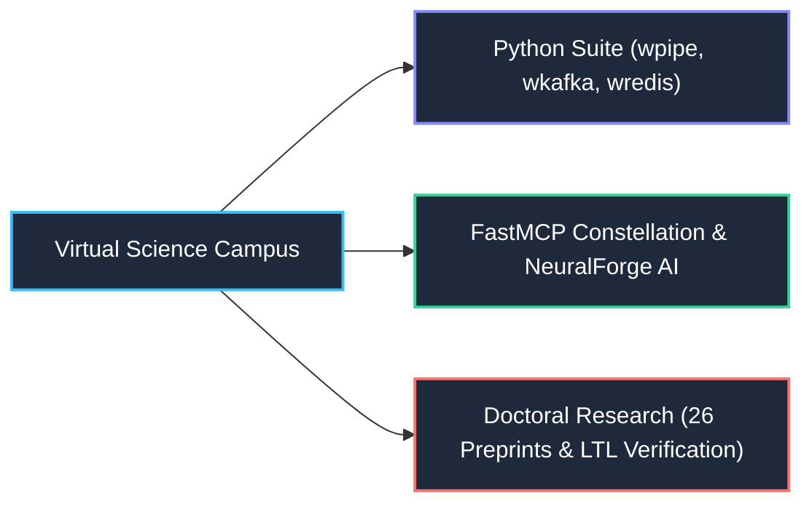

# Wisrovi Legacy 2.0 (Interactive Web RPG Portfolio)

  
  
  
  
  

This repository hosts the official deployment of **Wisrovi Legacy 2.0**, an interactive Web RPG designed to showcase the complete engineering and scientific research career of **William Steve Rodriguez Villamizar (wisrovi)**—from foundational electronic engineering and audio signal processing DSP (2010), through the 23-package PyPI Binary Universe and the NeuralForge AI distributed MLOps platform, to his doctoral research frontiers (26 CERN/Zenodo preprints).

---

## 🎮 Game Concept & RPG Mechanics (Adapted from `cv-game-v1.1`)

* **22 Step-by-Step Educational Missions**: Spanning 6 chronological phases from Electronic Engineering (UDI 2010–2016) and `ProcessAudio`, through the 23 PyPI libraries, FastMCP agents, NeuralForge AI (the 22-step forensic worker lifecycle), to doctoral research (Causal Saliency Regularization, Conformal Prediction, Formal LTL Verification).
* **Dual Perk Skill Tree**: 18 unlockable skills providing tangible gameplay buffs (speed boosts, radar radius, magnetic coin attraction, XP multipliers, and obstacle immunity).
* **Multi-Gem Economy**: 5 colored gems (Blue, Green, Amber, Purple, Red) plus coins with dynamic spawning across the campus.
* **Magnetic Attraction (`magnetRange`)**: Automatically draws nearby coins and gems toward the player's vehicle in real time.
* **Non-Violent Collaborative Multiplayer**: Peer-to-peer presence synchronization via `BroadcastChannel` with player inspect cards and real-time coin gifting.

---

## ☁️ Storage Architecture (wticket Cloud Pattern)

* **Dual-Tier Hybrid Persistence**:
  * **Tier 1 (Local Zero-Latency)**: High-speed IndexedDB engine (`wisrovi_game_db`) mirroring `wticket`'s object store architecture (`player_profile`, `inventory`, `missions_state`, `unlocked_skills`, `sync_metadata`). Works 100% offline.
  * **Tier 2 (Cloud D1 Database)**: Background synchronization with Cloudflare Workers + D1 SQL database (`https://wticket-api.wisrovi-rodriguez.workers.dev`), allowing cross-device save synchronization and global leaderboards.

---

## 👨‍💻 About the Author

* **Author**: William Steve Rodriguez Villamizar (wisrovi)
* **Role**: Principal AI Engineer & AI Solutions Architect | Ph.D. Candidate in AI & Formal Verification
* **Publications**: 26 scientific preprints with official CERN Zenodo DOIs | [ORCID: 0009-0005-0710-1861](https://orcid.org/0009-0005-0710-1861)
* **Open Source Suite**: 23 official Python packages published on [PyPI](https://pypi.org/user/wisrovi/) (Binary Universe architecture with 6 FastMCP servers)
* **Portfolio**: [wisrovi.dev](https://wisrovi.dev) | [LinkedIn](https://linkedin.com/in/wisrovi-rodriguez)

---

## 👤 Autor & Afiliación Oficial

* **William Steve Rodriguez Villamizar (Wisrovi)**
* **Cargo:** Principal AI Engineer & Applied AI Solutions Architect | Scientific Researcher
* 📧 **Email:** [wisrovi.rodriguez@gmail.com](mailto:wisrovi.rodriguez@gmail.com) / [wisrovi@wisrovi.dev](mailto:wisrovi@wisrovi.dev)
* 🌐 **Portal Oficial:** [wisrovi.dev](https://wisrovi.dev)
* 💼 **LinkedIn:** [wisrovi-rodriguez](https://www.linkedin.com/in/wisrovi-rodriguez/)
* 🆔 **ORCID:** [0009-0005-0710-1861](https://orcid.org/0009-0005-0710-1861)
* 📦 **PyPI:** [pypi.org/user/wisrovi/](https://pypi.org/user/wisrovi/)
* 🐙 **GitHub:** [@wisrovi](https://github.com/wisrovi)
