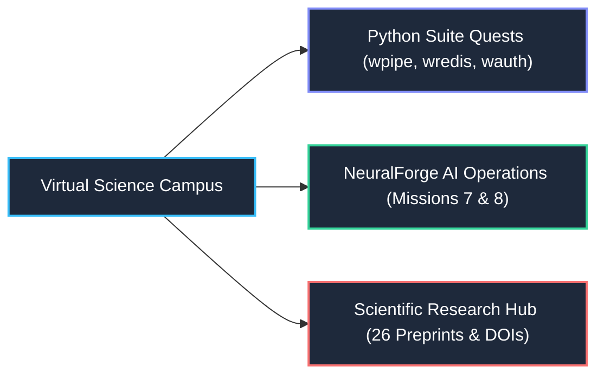

# Wisrovi Legacy (Interactive Web RPG Portfolio)

  
  
  
  
  

This repository hosts the official deployment of **Wisrovi Legacy**, an interactive Web RPG designed to showcase the scientific research publications, custom software suite, and distributed MLOps architectures developed by **William Steve Rodriguez Villamizar (wisrovi)**.

The game is built purely using **Vanilla JavaScript**, **HTML5**, and **WebGL/Three.js** for real-time procedural 3D rendering—no heavy game engines or bundlers required.

---

## 🎮 Game Concept & Interactive Showcase

Instead of a traditional static resume, **Wisrovi Legacy** represents an interactive simulation where players drive around a virtual university/science campus, complete quests, and learn about real-world software components:

* **Custom Python ORMs & Libraries (The wisrovi SUITE)**: Quests are themed around real libraries authored by William Rodriguez (e.g., `wpipe`, `wsqlite`, `wredis`, `wkafka`, `wauth`).
* **NeuralForge AI (Distributed YOLO Cluster)**: Dedicated missions (Missions 7 & 8) introduce the distributed training ecosystem, Optuna evolutionary hyperparameter optimization, strict Redis priority queues (`private > high > medium > low`), and ephemeral Docker worker execution.
* **Scientific Research Hub**: Explores research foundations covering quantitative Explainable AI (Grad-CAM/Eigen-CAM fidelity), causal saliency regularization, conformal prediction, and formal verification with Linear Temporal Logic (LTL).
* **Educational Quests**: Direct interactions with server racks, terminals, and NPCs provide concrete insights into microservices architecture, GIL bypassing, thread pools, and zero-trust cryptography.

---

## 🛠️ Technical Architecture & Features

* **3D Procedural Engine**: Three.js WebGL renderer with canvas-generated procedural building facade textures, dynamic asphalt lanes, ramps, and vehicle physics (acceleration, drifting, collisions).
* **Modular Glassmorphic UI**: Vanilla CSS & JavaScript panels for real-time mission tracking, resource balances (coins, multi-color gems, XP), upgrade marketplace, and dialogues.
* **State Persistence**: LocalStorage-based save & load mechanics (`F5` to save state, `F9` to load state).
* **Zero Dependencies**: Fast startup with zero bundling pipeline; runs directly on GitHub Pages via ES6 modules.

---

## 👨‍💻 About the Author

* **Author**: William Steve Rodriguez Villamizar (wisrovi)
* **Role**: Principal AI Engineer & Applied AI Solutions Architect | Scientific Researcher
* **Publications**: 26 scientific preprints with official CERN Zenodo DOIs | [ORCID: 0009-0005-0710-1861](https://orcid.org/0009-0005-0710-1861)
* **Open Source Suite**: 26+ Python packages published on [PyPI](https://pypi.org/user/wisrovi/)
* **Portfolio**: [wisrovi.dev](https://wisrovi.dev) | [LinkedIn](https://linkedin.com/in/wisrovi-rodriguez)